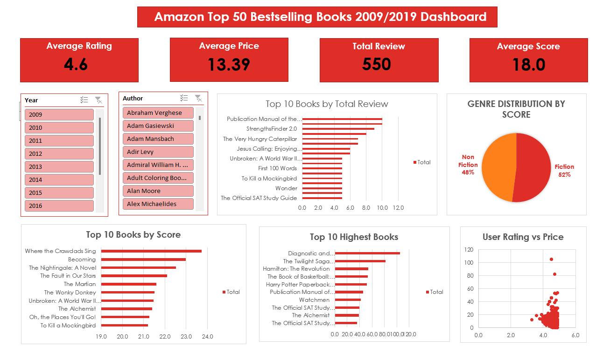

# Amazon Top 50 Bestselling Books 2009/2019:

This Excel dataset is a collection of data related to the top 50 best-selling books on Amazon for each year between 2009 and 2019.

**The dataset includes the following variables:**

•	Name - The title of the book.
•	Author - The name of the book's author.
•	User Rating - The average rating of the book as provided by Amazon users.
•	Reviews - The total number of reviews the book has received on Amazon.
•	Price - The price of the book in US dollars.
•	Year - The year the book was published.
•	Genre - The genre of the book.

The Amazon Top 50 Bestselling Books can be used to explore trends in book sales on Amazon over a decade and is useful to data analytics beginners.

# Analysis Questions:
**What is the average rating of the books?** 
-	The average user rating of the books is 4.6, indicating that overall, the books in -the dataset are highly rated by readers. This suggests a generally positive reception and satisfaction across the collection.

**What is the distribution of the number of reviews received by the books?**
-	The distribution of the number of reviews indicates that a small subset of books dominates reader engagement. Two titles—Publication Manual of the American Psychological Association, 6th Edition and The 5 Love Languages: The Secret to Love That Lasts—received the highest review counts, with 10 reviews each. This is followed closely by StrengthsFinder 2.0 with 9 reviews, and Oh, the Places You’ll Go! with 8 reviews. Several popular titles, including The Very Hungry Caterpillar and The 7 Habits of Highly Effective People, garnered 7 reviews each. The majority of other books in this list received between 5 and 6 reviews, reflecting a moderate but consistent level of reader interaction across the dataset.

**Which book has the highest price?**
-	The book with the highest price in the dataset is Diagnostic and Statistical Manual of Mental Disorders, 5th Edition: DSM-5, priced at $105.00. This price point significantly exceeds that of other titles, with the second-highest being The Twilight Saga Collection at $82.00. The notable price difference suggests that the DSM-5, being a specialized professional reference, holds a premium value compared to the primarily entertainment or general interest books in the list.

**What is the correlation between the rating and the price of the books?**
-	The correlation coefficient between user rating and book price is -0.12, indicating a very weak negative relationship. In practical terms, this suggests that higher-priced books tend to have slightly lower ratings, but the relationship is so weak that price is not a meaningful predictor of rating in this dataset.

**What is the distribution of the genres of the books?**
-	The genre distribution based on the average score shows that Fiction books have a slightly higher average score (18.8) compared to Non-Fiction books (17.3). This suggests that, on average, Fiction titles in the dataset receive a stronger combination of high ratings and larger review counts, indicating higher overall engagement and reader approval.

